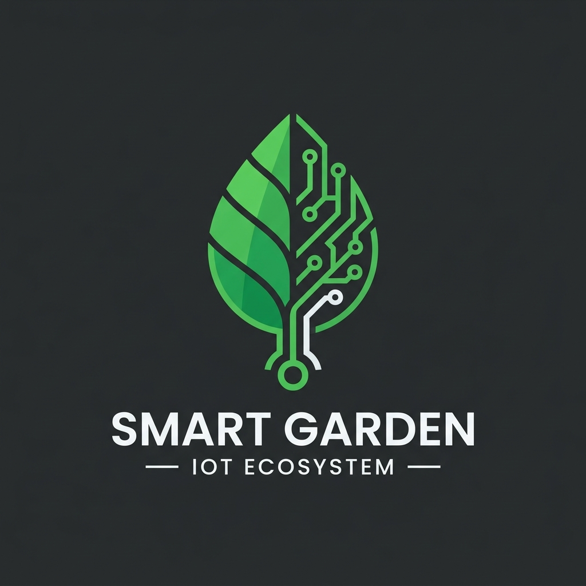

# 🌿 Smart Garden IoT - Hệ Thống Tưới Tiêu & Giám Sát Nông Nghiệp Thông Minh

Chào mừng bạn đến với dự án **Smart Garden IoT**. Đây là một hệ thống nhúng toàn diện kết hợp công nghệ Internet of Things (IoT) để tự động hóa việc giám sát môi trường và điều khiển thiết bị tưới tiêu cho khu vườn. Dự án cung cấp cả giao diện phần cứng hiển thị trực quan và một ứng dụng Web bảng điều khiển (Dashboard) thời gian thực.

## 🚀 Tính năng nổi bật

- **Tự động hóa thông minh (Auto Mode):** Tự động bật máy bơm khi đất khô và tắt khi đất đủ ẩm. Tự động bật đèn quang hợp (Grow LED) khi trời tối.
- **Giám sát thời gian thực (Real-time Monitoring):** Cập nhật liên tục các thông số: Độ ẩm đất, Nhiệt độ & Độ ẩm không khí, Cường độ ánh sáng và Mức nước trong bồn chứa.
- **Cơ chế an toàn 3 lớp (Safety Mechanisms):**
  - Cảnh báo "Sắp hết nước" (11-20%) với còi bíp thưa.
  - Cảnh báo "Khẩn cấp" (Dưới 10%): Khóa máy bơm để chống cháy (chạy khô), hiển thị cảnh báo chữ đỏ trên Web & LCD, còi hú liên tục.
  - Cảnh báo "Quá nhiệt": Còi hú báo động khi nhiệt độ quá cao.
- **Tương tác 2 chiều mượt mà:** Điều khiển máy bơm và cấu hình ngưỡng cảnh báo trực tiếp từ Web App.
- **Giả lập môi trường tự nhiên:** Khi máy bơm được bật để làm mát, hệ thống tự động nội suy giảm dần nhiệt độ môi trường, mang lại cảm giác chân thực nhất.

---

## 🛠 Công nghệ sử dụng

### 1. Phần cứng (Hardware - Wokwi Simulation)
- **Vi điều khiển trung tâm:** ESP32 (Board: ESP32-DevKitC V4). Hỗ trợ kết nối Wi-Fi tích hợp.
- **Cảm biến (Sensors):**
  - `DHT22`: Cảm biến nhiệt độ và độ ẩm không khí.
  - `LDR (Photoresistor)`: Cảm biến quang trở đo cường độ ánh sáng.
  - `Potentiometer` (Biến trở): Dùng để giả lập sự biến thiên của Độ ẩm đất và Mực nước.
- **Giao diện người dùng (HMI):** 
  - `LCD 16x2 (I2C)`: Hiển thị thông số môi trường trực tiếp tại vườn.
  - `Pushbutton`: Nút nhấn vật lý cho phép bật/tắt bơm trực tiếp không cần mạng.
  - `Buzzer`: Còi chip phát âm thanh cảnh báo lỗi.
- **Cơ cấu chấp hành (Actuators):** Các LED màu giả lập cho Máy bơm (Pump) và Đèn quang hợp (Grow Light).

### 2. Phần mềm & Nền tảng (Software & Platforms)
- **C++ (Arduino Framework):** Ngôn ngữ lập trình chính cho ESP32.
- **PlatformIO:** Môi trường biên dịch và quản lý thư viện (Quản lý các thư viện `PubSubClient`, `ArduinoJson`, `LiquidCrystal_I2C`, `DHT sensor library`).
- **Giao thức MQTT (Message Queuing Telemetry Transport):** Sử dụng Broker công cộng `broker.hivemq.com` cho tốc độ kết nối thời gian thực cực nhanh và nhẹ.
- **Web App:** Xây dựng bằng thuần HTML, CSS (hỗ trợ biến CSS hiện đại, giao diện Material/Glassmorphism) và JavaScript (sử dụng MQTT.js qua WebSockets).

---

## ⚙️ Sơ đồ chân kết nối (Pinout)

| Linh kiện | Chân trên ESP32 | Mô tả |
| :--- | :--- | :--- |
| **DHT22** (Data) | `GPIO 13` | Đọc nhiệt độ, độ ẩm không khí |
| **Cảm biến đất** | `GPIO 34` | (Analog) Đọc độ ẩm đất |
| **Cảm biến nước**| `GPIO 35` | (Analog) Đọc mức nước trong bồn |
| **LDR Ánh sáng** | `GPIO 32` | (Analog) Đọc cường độ sáng |
| **LCD 16x2 (SDA)**| `GPIO 21` | Giao tiếp I2C Data |
| **LCD 16x2 (SCL)**| `GPIO 22` | Giao tiếp I2C Clock |
| **Máy bơm (LED)** | `GPIO 14` | Điều khiển bật/tắt bơm |
| **Đèn LED Grow** | `GPIO 27` | Điều khiển bật/tắt đèn |
| **Còi Buzzer** | `GPIO 25` | Còi cảnh báo nguy hiểm |
| **Nút nhấn (Btn)**| `GPIO 26` | (INPUT_PULLUP) Điều khiển thủ công |

---

## 📖 Hướng dẫn sử dụng hệ thống

### 1. Khởi động hệ thống
- Hệ thống được thiết kế để chạy trên phần mềm VS Code với tiện ích mở rộng **Wokwi Simulator**.
- Cắm điện (Nhấn nút **Play** trên Wokwi). ESP32 sẽ hiển thị màn hình khởi động trên LCD và tiến hành kết nối vào mạng Wi-Fi.
- Sau khi có dòng chữ `WiFi Connected`, ESP32 sẽ kết nối đến MQTT Broker và bắt đầu truyền dữ liệu.

### 2. Theo dõi qua Web Dashboard
- Mở file `smart_garden_simulation.html` (Nên dùng tính năng *Live Server* của VS Code).
- Bảng điều khiển (Dashboard) sẽ kết nối đồng bộ với mạch ESP32. Mọi thay đổi về cảm biến tại Wokwi sẽ hiển thị trên Web trong vòng chưa tới 1 giây.

### 3. Tương tác & Điều khiển
- **Chế độ Tự động (Auto):** Hệ thống sẽ khóa các nút bấm trên Web. Bơm tự động chạy khi đất khô (<40%) và bồn còn nước.
- **Chế độ Thủ công (Manual):** Bật công tắc chế độ sang Thủ công. Bạn có thể tự do gạt công tắc bật/tắt Bơm và Đèn chiếu sáng.
- **Sử dụng Nút nhấn cứng:** Bấm trực tiếp nút màu xanh lá trên mạch mô phỏng. Bơm sẽ bật/tắt lập tức, và Web Dashboard sẽ tự nhận diện sự thay đổi này và ghi log.
- **Tab Cài đặt (Settings):** Chuyển sang thẻ "Cài đặt" trên Sidebar trái của Web để chỉnh sửa Ngưỡng cảnh báo nhiệt độ và Ngưỡng tưới ẩm đất. Hệ thống ESP32 sẽ nhận cấu hình và phản hồi ngay lập tức.

### 4. Xử lý các tình huống cảnh báo
- **Còi bíp thưa thớt + Log vàng trên Web:** Bồn chứa sắp cạn nước (11-20%). Hệ thống vẫn cho phép tưới. Bạn cần kéo thanh trượt `pot_water` lên cao để châm thêm nước.
- **Còi hú liên tục + Chữ đỏ trên LCD + Khóa Bơm:** Mức nước dưới 10%. Tuyệt đối không thể bật bơm. Hãy châm thêm nước.
- **Còi hú + Cảnh báo Nhiệt độ:** Nhiệt độ vượt ngưỡng cho phép (Mặc định >35°C). Bạn hãy bật máy bơm để làm mát. Khi bơm chạy, tiếng còi sẽ tắt và nhiệt độ sẽ được giả lập giảm dần.

---
*Phát triển bởi đội ngũ đam mê IoT & Tự động hóa. Chúc bạn có những trải nghiệm tuyệt vời cùng Smart Garden!* 🌿
